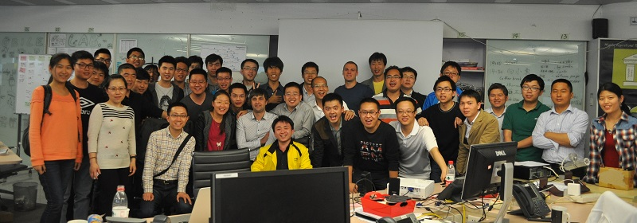
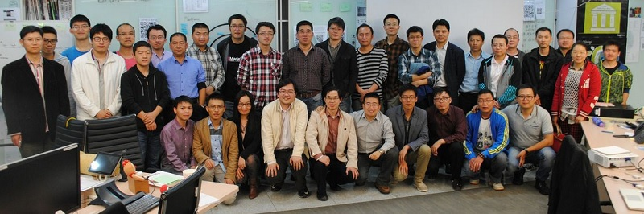

[Edit this page](https://github.com/spring-ug/beijing/edit/gh-pages/index.md),
[Ask question](https://github.com/spring-ug/beijing/issues)

###　“你来说”活动 1月9日 "Сome ant Talk" #2 meet-up

Next meeting is planned for Friday Jan 9th 2015, to make it together call 187 01029146 Paul  
下一个见面希望在2015年1月9日准备。讲师，志愿者请联系 187 01029146 伟保罗

[meetup.com link for registration](http://www.meetup.com/BeijingEntrepreneurs/events/219124667/)

###　“你来说”活动 12月5日 "Сome ant Talk" meet-up

Next event is planned for Dec 5th 2014, to make it together call 187 01029146 Paul  
下一个活动希望在2014年12月5日准备。讲师，志愿者请联系 187 01029146 伟保罗

Register at 报名在 <https://yoopay.cn/event/88917198>

## Spring User Groups

Spring is set of [open-source technologies](http://www.gopivotal.com/oss)
 and [projects](http://spring.io/projects) [*](https://github.com/spring-projects/)
 developed by [Pivotal](http://www.gopivotal.com/).

The most well-known of them is [spring framework](https://github.com/spring-projects/spring-framework).
The latest version is [4.1.1](http://mvnrepository.com/artifact/org.springframework/spring-core)
 [released](http://spring.io/blog/2013/12/12/announcing-spring-framework-4-0-ga-release) in December 2013. 

### Spring User Group in Beijing 北京Spring用户组

- our site <http://spring-ug.github.io/beijing> 我们的网站
- QQ group 264930871 Spring中国用户组
- WeChat/Weixin Spring中国用户组

### Posts and news

<ul class="posts">
  
    <li>{{ post.date | date_to_string }} &raquo; <a href="/beijing{{ post.url }}">{{ post.title }}</a></li>
  
</ul>

[RSS/Atom feeds](http://spring-ug.github.io/beijing/feed.articles.xml)

<!--  -->

#### Events 活动

#### Next 未来

##### Past 之前

###### 2

- Sunday May 11th 2pm

- 周日，5月11日 2点钟 

register 报名 <https://yoopay.cn/event/82637910>

details at <https://github.com/spring-ug/beijing/wiki/Spring.io-Beijing-event-May-11th>

###### 1

past event Saturday April 12th 2pm - 4月12日 周六 2点 是之前的活动

Some work in progress can be found on [wiki](https://github.com/spring-ug/beijing/wiki) 有暂时信息。

Registration via:

- <https://yoopay.cn/event/58458792>

  

- WeChat/Weixin Speakers and organizers

- [BSCMG](http://www.meetup.com/BeijingSoftwareCraftsmanship/events/170135002/)
- [wiki](https://github.com/spring-ug/beijing/wiki)
- more options to come...

#### Links

- [macrochen的博客 - Spring分类文章列表 - ITeye技术网站](http://macrochen.iteye.com/category/56050)
- 搁iteye. 这个网站比较专业

